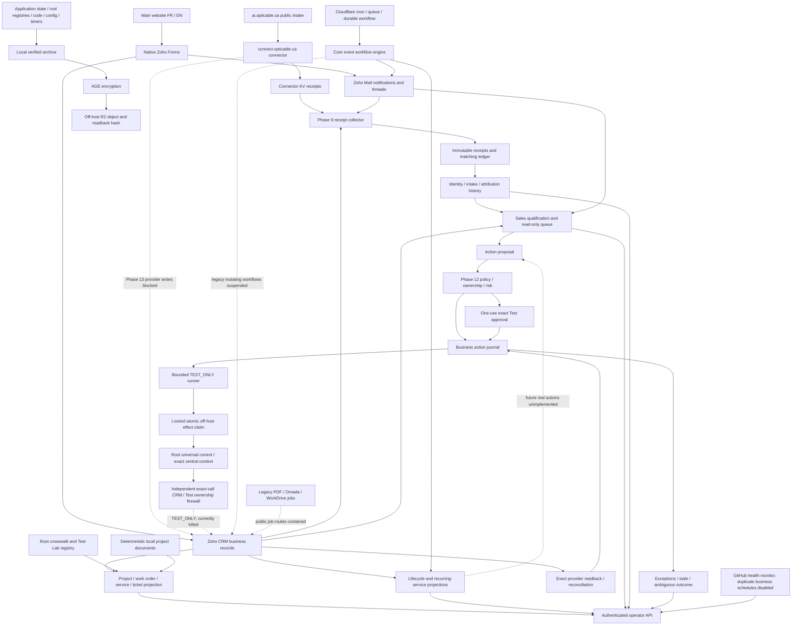

> Current authority: [Phase 13 final remediation report](phase13-remediation-final-report.md). Exact deployed SHA is the root deployment receipt: `sudo cat /var/lib/optibrain/phase13-remediation/deployment.json`. Historical phase percentages are not readiness evidence.

# OptiBrain architecture blueprint

Authoritative Phase 13 audit, 2026-10-01, America/Toronto. This describes the deployed system and its containment, not a proposed finished product. Read alongside [the audit](phase13-independent-audit.md), [controls](phase13-control-matrix.md), [timers](phase13-timer-matrix.md), and [remediation backlog](phase14-optimization-backlog.md). Earlier phase percentages are not accepted as readiness measures.

## Purpose and current boundary

OptiBrain connects business intake, CRM identity, sales assistance, service lifecycle and delivery evidence to operator review. Zoho CRM owns business records. OptiBrain owns local receipts, execution evidence, crosswalks and approval state. Those local stores are safety-critical, not disposable caches.

The original core was ee7629f7e7954e1ee782c6481d4aaef37349d10f. The first P0 remediation main/deployed release was 852e5f7c815c90e56e701436f73ee4133f51a673 (PR89); the completion release includes this blueprint. API remains 1.11.0. Production, local main and remote main are verified against the root exact-SHA deployment receipt, rather than a hardcoded historical report. The independent connector was emergency-fixed in its own repository, PRs 30–32, final merge at aa1e084b06184df73847639700a8e540bd433293.

Persistent Codex development autonomy is retired. Application read/reconciliation/backup timers continue. Only one exact central registered TEST_ONLY follow-up Task executor can obtain provider-write authority; both root and runner write switches currently remain OFF. Real customer sends and financial writes have no audit authorization. Native Zoho Forms ingestion is a separate provider-managed producer; the universal claim that every automatic provider write is OFF is not proven.

## Data and control flows

Solid edges describe reads and local evidence writes; the native Forms-to-CRM edge is independently evidenced provider ingestion, outside the Python firewall. The engine retains read-only Mail, Sign and Books observers. Its legacy draft/digest/contract-send workflows were disabled during Phase 13. Operator recommendations do not themselves invoke transport.

## Deployed components

| Component | Actual location / process | State and authority |
|---|---|---|
| Workflow API | /opt/opticable-api-platform/apps/workflow-api; Python 3.12.3 venv; uid opticable-workflow-api; localhost:8100 | ACTIVE; core events, read projections, authenticated operator routes |
| PDF service | apps/password-pdf-service; separate Python 3.12.3 venv; uid opticable-password-pdf; localhost:8000 | ACTIVE; health/rendering code retained; CRM and WorkDrive configuration disabled; external job creation/results contained |
| Omada service | apps/omada-site-service/dist; Node v22.23.3; uid opticable-omada-site; localhost:3210 | ACTIVE health/internal service; external non-health routes and core legacy job creation contained |
| Reverse proxy | Caddy, /etc/caddy/conf.d/opticable-api-platform.caddy | ACTIVE TLS 80/443; explicit ordered containment routes; admin localhost:2019 |
| Connector | Cloudflare opticable-ai-connector; separate GitHub repository | ACTIVE bounded reads; every non-GET/HEAD request and executable/unaudited read path rejected before OAuth/transport |
| Control plane | Cloudflare opticable-control-plane, cron, business queue, DLQ, durable workflow | ACTIVE event dispatch/retry; not the development worker |
| Public website | Cloudflare opticable-website; ai.opticable.ca and main-site forms | ACTIVE public UI; connector-backed CRM ingestion currently suspended |
| Installed runner | /usr/local/lib/optibrain/phase12-run-test-lab.py | ACTIVE read/reconciliation; Test Task writes killed; root, bounded, flock, provider ownership revalidation |
| Installed backup helpers | /usr/local/lib/optibrain-backup | ACTIVE backup 1.0.2 after Phase 13 scope correction |
| Development controller | /opt/optibrain-agent and legacy control/runtime files | RETIRED; six units MASKED/inactive, originals archived and authorization file absent |
| Old worktrees/branches | /home/optibrain, /tmp, /var/tmp, Git refs | DISABLED/ARCHIVAL; no active dispatcher; review before deletion |
| Camplan / plan2 | Cloudflare opticable-camplan, opticable-plan2 | Adjacent deployed applications; not a grant of CRM/autonomy authority |
| Preview workers | website-test and website preview/design/performance workers | ORPHANED/UNKNOWN lifecycle; deprecation review needed |
| hoplajeux-reservation-email | Cloudflare account inventory | Separate application; outside OptiBrain business authority |

The Omada dist tree is a generated deployed artifact. Intrinsic health-only containment was compiled from reviewed remediation source and TypeScript build is now a CI requirement. Generated artifacts and root-installed helpers still need independent deployment/hash verification. Python service sources were inspected directly. Git alone is insufficient to describe root-installed helpers or provider workers.

## System of record and canonical concepts

| Concept | System of record / module | Local cache or ledger | Provider ID | Canonical ID / relationships |
|---|---|---|---|---|
| Lead | Zoho CRM Leads | Sales projection, intake history, root Test registry | CRM numeric ID | Raw provider ID in Phases 8–10; no separate durable provider-neutral Lead ID |
| Contact | Zoho CRM Contacts | Operations crosswalk / sales reads | CRM numeric ID | OB-P-48-bit suffix in operations; Account_Name relationship |
| Account / customer | Zoho CRM Accounts | Lifecycle view / operations crosswalk | CRM numeric ID | OB-C-48-bit suffix; parent of Contacts and Sites |
| Site | Zoho CRM Service_Locations | Root crosswalk / read-only service view | CRM numeric ID | OB-S-48-bit suffix; Linked_Account, Primary_Contact |
| Deal | Zoho CRM Deals | Attribution reads / operations registry | CRM numeric ID | Raw provider ID in sales/lifecycle; accepted Deal anchors OB-J project |
| Project | Root Phase 11 registry plus accepted CRM Deal | /etc/optibrain/phase11-operations.json projection | Deal ID | OB-J; no independent native Project module is used |
| Work Order | Zoho CRM Installations | Project registry / operational events | CRM numeric ID | OB-WO; Linked_Service; scheduling/status evidence |
| Ticket | Zoho CRM Cases | Project registry / repair-work linkage | CRM numeric ID | OB-T; customer/service/project relationship evidence |
| Service | Zoho CRM Services | Service inventory / crosswalk / state ledger | CRM numeric ID | OB-SV; Linked_Service_Location and Linked_Deal |
| Recurring Service | Services with verified recurring contract facts | Recurring projection | Service ID | Service, not a second business object; Deal-based legacy recurrence facts also remain |
| Task | Zoho CRM Tasks | Action journal / root Test registry | CRM numeric ID | OB-TK when crosswalked; What_Id and $se_module link target |
| Intake Event | Phase 9 local intake ledger; immutable Forms Mail or connector KV receipt is origin evidence | phase9-intake.db, phase9-form-receipts.db | Mail message ID / connector inquiry ID | Source event hash; canonical_id currently provider Lead ID |
| Marketing feedback | Phase 9 local feedback ledger | phase9-intake.db | Related CRM ID | OB-F evidence-bound event identity; TEST_ONLY; exports disabled |
| Lifecycle Event | Local verified lifecycle/service-state evidence | historical lifecycle-events.db plus current phase10-service-events.db | Account/Deal/Service IDs | Evidence-hash event IDs; current scheduled store is Test-only |
| Operational Event | Root Phase 11 project registry | JSON project event arrays | Related CRM ID/version | OB-E hash; terminal kind/object occurrence deduped |
| Action Proposal | Phase 12 business journal | phase12-autonomy.db actions and scheduled | Target provider ID; acknowledged effect ID after execution | Request-key hash, payload hash, expected version/state |
| Approval | Phase 12 business journal; older Phase 7 ledgers remain separate | approvals table / legacy grant ledgers | No provider approval ID | UUID; action/type/target/payload/actor/expiry binding |
| Exception | Journal action state and core execution-failure stores | Phase 12 view; automation_run_failures/failed-work views | Provider ID when known | No single cross-system exception object or resolution workflow |
| Document | Root project file tree and document manifest | /var/lib/optibrain/phase11/test-lab/files | Local path; no WorkDrive ID for Phase 11 documents | Project/date/name plus SHA-256 |
| Technical sheet / legacy Wi-Fi batch | Legacy PDF/Omada configuration; configured CRM Fiches_Techniques writer | Job JSON, payloads and generated artifacts | Configured CRM record ID / job ID | Parallel older model, not the canonical Service_Locations inventory; provider module read failed |

TEST_ONLY is an ownership property: protected IDs take precedence; mutating Test paths require root registries, visible markers, true flags where supported, exact relationships and current provider reads. Some native modules lack a boolean flag and require both subject/name and description markers. Flags alone grant no transport authority. Live read projections exclude synthetic flags and verified intake Test identities; all sampled protected flags remained false.

## Identity and attribution

Fifteen operational crosswalk entries were unique, deterministic and persisted across the API restart. Three project chains resolved; one linked three intake events through Lead, matching Contact email, Account, accepted Deal, Site, Project, Work Orders, installed Service, Case and repair Work Order. First_Source agreed across Lead/Contact/Deal in that chain. Five registered documents matched their hashes. No duplicate terminal kind/object event existed in sampled projects.

The operations stable_id function hashes module plus provider numeric ID, truncating SHA-256 to 12 hex characters. Its provider-independent docstring overstates the generator: persistence makes the existing crosswalk stable, but re-minting after migration changes IDs. Namespace/tenant and migration contracts are missing. Phases 8–10 still use raw CRM Lead IDs. Do not claim one universal provider-neutral identity scheme.

Identity policies distinguish exact match, new identity, possible duplicate, ambiguity and replay. Core controlled writers reject uncertainty. The independent connector previously selected the first search result and lacked protected ownership checks; it is contained. No automatic merge is authorized. Receipt/source identifiers also have inconsistent uniqueness scopes: connector keys are source-scoped while intake inquiry_id is globally unique.

## Workflows and ownership limits

Sales combines CRM facts, exact duplicate/relationship checks and thread-bound Mail evidence. Qualification, priority, missing facts, waiting/replied state, quote readiness, neglect and follow-up recommendations are read-only. The current live queue has 11 Leads, all missing critical project information. Lab evidence exercises high/low priority, duplicate, due/overdue, replied/waiting and quote-ready states.

Attribution preserves Test intake history separately from latest provider fields. Connector source overwrites/replay concurrency and native Forms mapping remain remediation subjects. The current fallback has exact name/company/phone binding, authenticated notification headers, Forms creation timeline proof, empty-or-equal field checks, email uniqueness, version preconditions, pre-transport attempt journaling and no blind replay. It was nevertheless allowed to write real post-baseline Leads and was turned OFF. Receipt reads and matching remain active.

Lifecycle treats real missing revenue as UNKNOWN, not zero. Installed one-time work does not become recurring revenue. Verified active recurring services suppress false dormancy. Live data returned 41 Accounts, no actionable verified lifecycle dates and no verified recurring rows; real MRR/ARR are null. Synthetic recurring totals are Lab-only: MRR CAD 840 / ARR CAD 10,080. Deal recurrence facts and canonical Services remain parallel representations to consolidate.

Operations is provider-backed for three Test projects. The live operations endpoint intentionally returns an empty projection without discovering real projects. It is not a deployed real delivery engine. Project metadata, canonical relationships, document manifests and events currently live in a root JSON registry. Keep Phase 11 documents LOCAL FOR NOW; a provider migration needs ownership, permissions, hashes and recovery contracts first.

## Consequential-action boundary

The universal transport fence admits only one exact central TEST_ONLY `crm.task.create` action; every other business mutator is disabled or forbidden before OAuth. Fixed root-owned `/etc/optibrain/mutation-control.json` must have trusted ancestry/owner/mode, a valid schema and exact Test authorization. Missing, malformed or substituted state denies. Root `test_writes_enabled=false`, `real_canary_allowed=false` and runner `OPTIBRAIN_BUSINESS_AUTO_WRITES=0` keep execution OFF. An approval, feature flag or legacy lower grant cannot override this fence. API runs unprivileged and cannot mint the root central/technical scopes.

The central dispatcher records an immutable full envelope, append-only hash-chained decisions/transitions/provider intent/response/reconciliation, and run/trigger context before attempted transport. It checks ownership, policy/risk, exact fresh target/version/state; the independent lower CRM firewall binds exact method/path/body/headers. The context is consumed before OAuth and revalidated before HTTP. Ambiguous provider acknowledgment never triggers a second mutation or mutation failover. Old incomplete histories remain explicitly incomplete.

The historical R3 Test approval machinery binds action/payload/target/actor/expiry/one-use and now rechecks kill policy before consumption. Actual Access-based human issuance was not exercised. EVERY Mail/Sign/draft/R3 provider write remains forbidden independently; no general unrestricted send endpoint exists.

Atomic conditional R2 claims under `business-effects/v1/<action_id>/` precede the admitted Task transport. An indefinite bucket lock protects claim/result objects. Existing, unavailable or ambiguous claims cannot grant a retry; exact provider action marker/target/hash readback and stored result permit reconciliation after stale backup or local journal loss. A real registered Test Task was created once and recovered from an empty journal without a second create. The runner reconciles before testing the kill policy. Restore keeps writers OFF until backup-gap effects are reconciled. This contract is not proof for disabled future create/send/onboarding classes.

## Security, secrets and network

SSH is key-only, root SSH login disabled. UFW exposes TCP 22/80/443. Caddy also listens UDP 443 but UFW has no corresponding allow rule. All application sockets and the Caddy admin API bind localhost. The api01.opticable.ca virtual host remains configured but did not resolve publicly during the audit.

Operator routes require verified Cloudflare Access RS256/JWKS issuer and audience plus an allowed human identity. The production audience matched the actual admin.opticable.ca Access application. Forged JWT/email headers failed. Shared-key authentication now fails closed when unset. OAuth query credentials are rejected; header credentials are required.

Environment files and OAuth credentials are private. /var/lib application parents are 0750 and root safety state is under root 0700. Some child DB/document files are 0644 but effective parent traversal prevents public reading. Core service hardening prevents privilege escalation, drops capabilities and limits writable state paths. Release dependencies are installed unprivileged and made root-owned/immutable before the guarded deployment. Root runner still imports application source from an operator-admin-controlled checkout; the long-term privilege model and source ownership should be simplified. PDF/controller execution is intrinsically retired.

Current credential literals were absent from 1,348 core and 85 connector reachable historical Git blobs and checked shell history. This is not proof against every historical/rotated secret. Connector client secret and key have been migrated to Cloudflare secret bindings. One inventory-filter error exposed the CRM channel credential in tool output; stored evidence was redacted. The channel credential has been rotated and the old credential rejected; and do not copy that output into documentation.

A separate operational scan found the current shared API key in historical
uvicorn URL access records. Raw HTTP access logging was disabled in the root API
override; business audit and service error journals remain active. Existing
private journal evidence was preserved. Cross-client API-key rotation and removal of URL credentials are complete: the new key works, old key returns401; GitHub/Cloudflare secret updates and current binding types were independently reconciled. The current provider watch credential matches local configuration; its expiry is2026-10-07T19:38:19Z. Do not print keys or restore revoked values from historical archives.

Runtime code reviewed does not turn CRM/email text into shell commands. SQL data is parameterized; dynamic PRAGMA identifiers come from static schema tables. HTML operator views escape provider text. Phase 11 names are project-scoped and reject traversal; root-only ancestry protects the present symlink boundary. Legacy job stores and uploads need authenticated, bounded, atomic storage before reopening.

## State, timers, observability and efficiency

Bounded P1 read/scheduler cleanup is documented in [phase13-p1-cleanup.md](phase13-p1-cleanup.md); its before/after provider evidence supersedes historical efficiency observations. Receipt checkpoints skip known Mail bodies; operations use exact-ID request-local batches; scheduled lifecycle uses conditional display snapshots with daily full checks and hourly cadence. These caches never authorize mutations. Expendable metrics/metadata are bounded; business evidence and owner P0 requirements remain unchanged. Development runtime is root-private archive/quarantine, all masks retained.

The canonical timer table is [phase13-timer-matrix.md](phase13-timer-matrix.md). Five application systemd timers are active. There are also Cloudflare and GitHub schedules. Development dispatch/status/usage units are distinct and remain MASKED.

Five active workflow SQLite files serve different purposes: automation.db, phase9-form-receipts.db, phase9-intake.db, phase10-service-events.db and phase12-autonomy.db. Historical lifecycle-events and staging/recovery DBs add three snapshots to the corrected backup. The core event engine uses leases, replay identities and bounded redrive; Phase 12 uses BEGIN IMMEDIATE plus a root flock. Root JSON registries use atomic replacement but have no shared cross-script lock. No automatic ledger retention is established.

Three duplicate GitHub business schedules (combined lifecycle, mailbox poll and owner digest) were disabled remotely and their cron triggers removed. Cloudflare is the canonical business observer scheduler; GitHub retains health monitoring. The receipt collector re-fetches three resources for each already-known Form message in a seven-day window every five minutes. With two messages this is about 2,016 Zoho Mail GETs/day before other observers. Lifecycle reconciliation adds about 240 CRM list calls/day at one page/module. Operator projections scan CRM lists and Mail; operations reads have N+1 per-object behavior. Bounds generally fail closed rather than run unbounded, but do not provide scalable pagination/caching. Local OAuth file/cache coordination reduces refresh storms; legacy PDF clients refresh per job when enabled.

Journals, execution-health endpoints, systemd results and GitHub health checks exist. They are not a consolidated operator or alerting surface. GitHub cron is not guaranteed every 15 minutes; sampled runs had long gaps. Exact-head CI and guarded remediation deployment succeeded; the earlier workflow failure was a missing manual release authorization, subsequently reconciled and rerun successfully. Retired duplicate schedule failures are historical evidence. Successful no-ops do not flood the Phase 12 exception view, but stale/denied fixtures persist and resolution/acknowledgement ownership is incomplete.

## Backup and recovery contract

Local backup1.0.2 captures source identity, online SQLite snapshots, application/root protection/crosswalk/journal/document state, /etc configuration, custom units/drop-ins, six retirement masks as explicit metadata, installed helpers and SSH recovery identity. It excludes encrypted-cache recursion. Archives are private, checksummed and verified. The first deployed remediation generation20261001T202728Z restored1,329 files,1,516 metadata entries and eight databases with six masks, all integrity checks PASS. Completion release receives a fresh generation; its exact ID/hashes are in the final receipt and `/var/lib/optibrain/phase2a/state.json`.

AGE ciphertext was independently downloaded from R2 and matched its hash. A temporary-key encrypt→upload→download→decrypt→restore roundtrip passed and the temporary private key/plaintext were removed. Restored source/config/state booted the actual unprivileged API with fresh dependencies inside isolated mount/network/PID namespaces, localhost only, no provider network, all writers OFF; health200/auth401/legacy403. The real owner-held offline identity was unavailable, so decryption for that recipient remains MANUAL-02. New OS installation, public DNS/TLS cutover and real provider OAuth reconnect were not executed; RTO is not guaranteed.

Nominal local-state RPO is daily. Off-host effect claims independently protect the admitted Task against backup-gap replay. Retention says seven generations, but preserve-existing disables pruning and encrypted caches accumulate; bounded retention/alerts are P1. On restore, keep development masks and all writers OFF, restore trusted controls/manifests/registries before traffic, preserve rotated credentials, and reconcile provider effects after the recovered generation before selective read/backup timer restart. The native Forms producer needs owner containment independently of restoring Python code. Cloudflare/GitHub versions/bindings and offline key custody must be recovered independently of the core Git bundle.

## Future direction

Consolidate identity contracts and event/exception ownership, route every consequential executor through one central policy with an independent transport fence, and retain provider-side reconciliation keys across local-state loss. Retire blocked legacy mutators and worker infrastructure after evidence is archived. Consolidate schedulers and operator navigation before adding more workflows. Improve real data quality before any one-action owner-authorized canary. This blueprint authorizes no expansion and starts no Phase 14 work.
