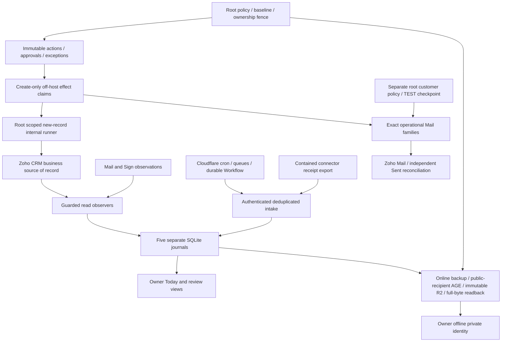

# OptiBrain architecture

AUTHORITATIVE CURRENT. Read [onboarding](OPTIBRAIN_CODEX_ONBOARDING.md) first. FastAPI core is `apps/workflow-api/workflow`; Current API contract: `1.20.0`. [Runtime](OPTIBRAIN_RUNTIME_CONTRACT.md) specifies services/network; [state](OPTIBRAIN_STATE_CONTRACT.md) specifies data/identity; [configuration](OPTIBRAIN_CONFIGURATION_INVENTORY.md) specifies authority.

CRM owns Lead, Contact, Account, Service Location, Service, Deal, Installation, Case and Task records. OptiBrain retains receipt lineage, internal crosswalks, saved cursors, action/approval envelopes and independent effect evidence. Display caches never authorize effects. Individual internal scopes cover eligible post-activation work; a distinct root policy gates four proved customer email families. Financial writes remain disabled. [Communications](OPTIBRAIN_CUSTOMER_COMMUNICATION_CONTRACT.md) specifies recipient/association/language proofs, suppression and the customer-only kill.

Caddy terminates origin TLS and denies legacy consequential routes before proxying to loopback services. Cloudflare Access additionally protects the operator prefix; origin independently verifies JWT audience, issuer and human allowlist. The shared API key authenticates technical endpoints and never substitutes for a human approval identity. Provider scope is capability, not runtime authorization.

Core OAuth uses `/var/lib/opticable-api-platform/shared/zoho-oauth.json`, a locked credential-bound access cache and one specific read-only 401 refresh/retry. The contained connector owns separate Cloudflare KV OAuth state. CRM/Mail reads are operational dependencies; optional Gmail/Calendar/Ads/Meta/LinkedIn/Desk/analytics are **DEFERRED — NON-CRITICAL**. Books transport rejects writes independent of scope. OVH direct core transport rejects non-GET; gateway mutation tooling additionally requires human confirmation/reason/audit and is outside automatic business authority.

Read-only receipt and service observers, native watch/delta and edge delivery have different scopes. Root TEST runner reconciles retained evidence before considering its disabled write gates; bounded root oneshots are required for private backup/upload/ownership boundaries. No persistent engineering worker exists. Rebuild defaults stop all application schedulers as well as writers.

Mail metadata/body cache avoids unchanged content GETs without replacing immutable events. CRM service projections and Today caches are rebuildable display state with source timestamps. Readiness is provider-free and combines durable provider observations with bounded local and GET-only queue samples. A measured queue backlog does not authorize replay.

Code rollback preserves DBs/claims; disaster restore starts isolated with writers off and reconciles effects newer than the backup. The clean rebuild uses fresh packages, current repository definitions, named identities and the verified golden archive. The snapshot is fast whole-VM rollback insurance; it is not required by reconstruction. Evidence and remaining proof limits are in [rebuild evidence](phase15-rebuild-evidence.md).

CRM is the main business cockpit. Native Finance Estimates/Invoices backed by Books are the only transaction model; native CRM Quotes/Invoices remain hidden. One Deal normally covers one Site. [Finance contract](OPTIBRAIN_FINANCE_INTEGRATION_CONTRACT.md) and [scope](OPTIBRAIN_REAL_AUTOMATION_SCOPE.md) define current relationships and authority.

Services are durable installed systems; additional accepted work and return visits reuse them without reparenting their original Deal. Installation-to-Service joins plus root visit lineage retain the current work's Account/Contact/Deal/Site context. Owner scheduling/completion is verified against native timelines. Completion activates only mutable new Services; existing Active references remain read-only. Finance observation derives invoice/payment attention without writes. Support context is prepared, while automatic Case creation remains unarmed without a deterministic producer.

The existing root internal runner now supplies hourly GET-only [recurring lifecycle](OPTIBRAIN_RECURRING_SERVICE_CONTRACT.md) and [marketing/Finance lineage](OPTIBRAIN_MARKETING_ATTRIBUTION_CONTRACT.md) projections. Books retains recurring billing. No new provider-write scope, custom field, module, financial engine or advertising writer is introduced. Missing native linkage remains human attention/unattributed.

One owner-only [Business Overview](OPTIBRAIN_BUSINESS_INTELLIGENCE_CONTRACT.md) calculates Toronto period/pipeline/customer/financial/recurring metrics from a minimized root API-group projection. Native Books payment/expense reads supplement the existing hourly observer. No warehouse/new DB, timer, provider writer or business field. [Measurement contract](OPTIBRAIN_MEASUREMENT_CONTRACT.md) records actual GA4/Ads observations and unresolved lineage/provider setup.

## Apollo coexistence and Today Sales

Read [sales intelligence contract](OPTIBRAIN_SALES_INTELLIGENCE_CONTRACT.md) and [current Claude/Apollo flow](CURRENT_CLAUDE_APOLLO_FLOW.md). `/v1/operator/sales` adds coordinated reply/Lead/Deal/Estimate/customer attention and up to five additive public project reviews. Existing Apollo outreach stays under Claude/Apollo; new OptiBrain prospecting is SHADOW ONLY, with no sends/enrollments/CRM bulk promotion. Exact collision and suppression holds never grant contact clearance. Local owner feedback does not alter Apollo suppression. No takeover/migration is authorized.

## Acquisition intelligence — research only

[Acquisition](https://optibrain.opticable.ca/v1/operator/acquisition) combines search, company/project signals, competitors, SEO/content and future paid research into a handful of owner actions. Read the [acquisition contract](OPTIBRAIN_ACQUISITION_INTELLIGENCE_CONTRACT.md), [market policy](OPTIBRAIN_MARKET_OPPORTUNITY_CONTRACT.md) and [sources](OPTIBRAIN_MARKETING_DATA_SOURCES.md). Raw research stays outside CRM; Claude/Apollo keeps outreach. Priorities are market-based, with unknown demand/CPC/ROI labeled. Existing pages are improved before duplicate pages are proposed; new-page candidates need owner expertise and demand validation. No content publication, campaign change, cold send or conversion upload is enabled by this view.

Completion remediation1–2 adds source-auth/collection freshness separation, strict versioned Forms context, sample/geography evidence and current trigger-actor safeguards. Derived research remains outside CRM; no additional provider-write authority.
