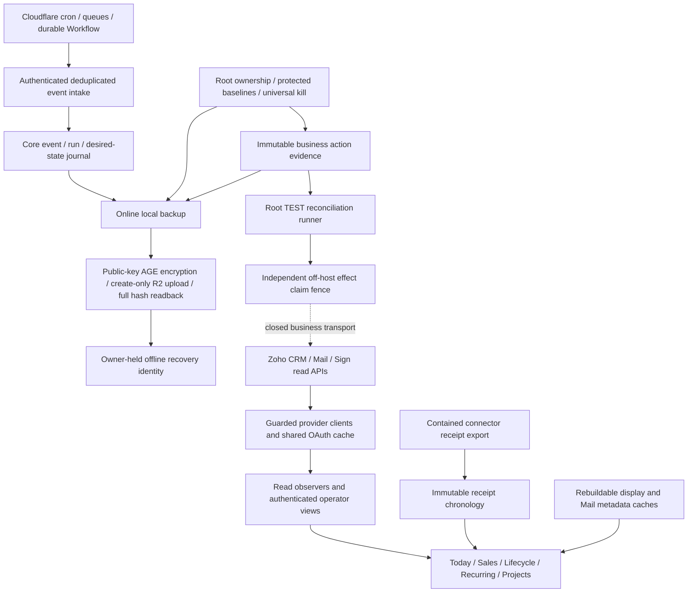

# OptiBrain architecture blueprint

Current API contract: `1.12.0`. Current implementation contracts are in this document and the [master runbook](OPTICABLE_AUTOMATION_MASTER_RUNBOOK.md). The deployed identity and certification are the root release receipt and final-verification artifact. [Phase 13 architecture](history/phase13-OPTIBRAIN_ARCHITECTURE_BLUEPRINT.md) is retained as historical evidence.

OptiBrain observes intake, sales, installed services and work requiring owner review. CRM owns business records; OptiBrain owns local chronology and immutable execution evidence. Current production is read-only for real business. Customer sends, protected mutations and Books writes remain zero.

## Runtime boundaries

FastAPI is unprivileged. Caddy terminates TLS and contains legacy routes. PDF and Omada services retain local/supporting health responsibilities, with consequential provider/public job paths denied. Three root oneshots remain: backup, uploader and TEST runner. Root is necessary for backup metadata/private source access; uploader/runner identities remain bounded because their private recovery/claim boundaries would otherwise need redesign. Runner capabilities and policy write paths are reduced. Manual owner/Codex sudo is unchanged.

Five timers have distinct responsibilities. Cloudflare observes and delivers; local receipt/service timers collect different durable facts; native watch and delta are independent read fallback paths; GitHub monitors health. None grants real automation authority. Three disabled GitHub business workflows remain disabled. No preview Worker, queue or unknown consumer was deleted to make topology look smaller.

## Safety and data contracts

The central root mutation policy, family gate, exact action payload/target/version, TEST_ONLY marker plus registry ownership, immutable journal envelope and off-host claim all apply conjunctively. A successful HTTP response or display snapshot cannot replace fresh mutation preconditions. Ambiguous transport reconciles; a missing or stale local journal cannot obtain a second off-host claim. Books writes remain independently denied. Protected baseline identity takes precedence over synthetic markers.

Five SQLite stores remain separate: core orchestration, Forms/connector receipts, canonical intake, service occurrences/display inventory and business action evidence. Three historical DBs are archived in place for recovery compatibility, never current mutation authority. Mail metadata/checkpoints and CRM display snapshots are expendable, backed up incidentally but not ownership evidence. See [state contracts](phase14-state-store-matrix.md).

## Read efficiency and visibility

Mail first completes bounded one-based metadata pagination at a fixed cutoff, checks committed event identity and a durable metadata/body cache, then retrieves content only when unseen, changed or expired. Normal scans overlap two days; daily audits cover seven days. Gaps beyond seven days and incomplete/overlapping pages fail closed without advancing the successful checkpoint. A known changed body creates an exception, never replacement of immutable evidence.

Lifecycle and recurring use one complete five-module projection, observed within five minutes and audited daily for deletions. Project detail restricts dependency batches to the requested registered project. Lab receipt/intake chronology uses bounded grouped local queries. Today has a live-only 60-second process display cache; failures are not cached, source timestamps stay intact and every browser response remains private/no-store.

Readiness combines durable provider observations/checkpoints, queue state, native verification and a root local sampler. It performs no provider read or repair. A 200 liveness response can coexist with ACTION REQUIRED readiness. Unknown remote queue depth remains explicit. Repeated provider-call excess, stale success times, disk/staging/DB/log thresholds are bounded warnings; they do not stop safe reconciliation or grant authority.

## Release and recovery

One root-owned release gate validates main CI, exact SHA, ancestry, rollback backup, immutable venv and closed safety state. It extracts pins/version as data, restarts the API, checks service/timer/DB health and records one schema-1 receipt. Rollback changes code/config/venv; it preserves journals and never replays a stale DB. Historical installers refuse execution. [Recovery maturity](phase14-recovery-runbook.md) distinguishes proven local/off-host/owner decryption evidence from untested OS replacement, reconnect and DNS/TLS cutover.
