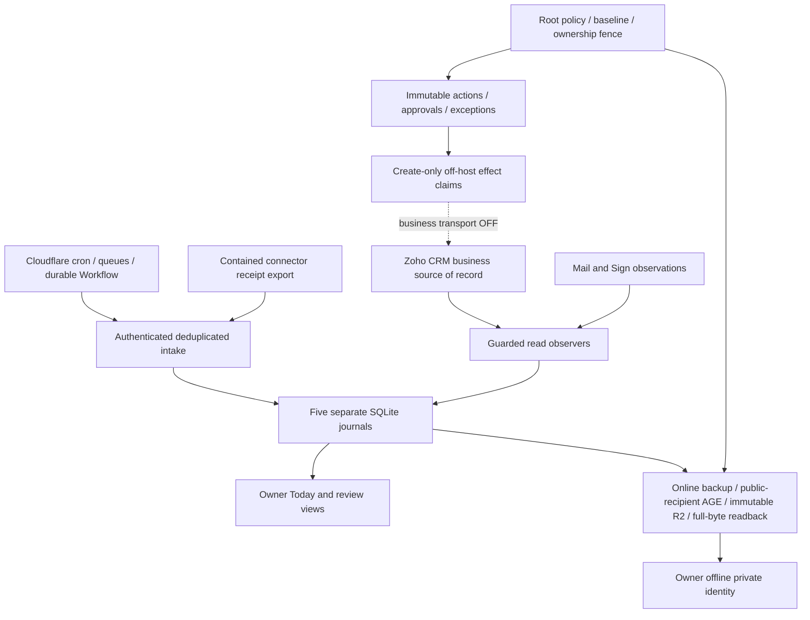

# OptiBrain architecture

AUTHORITATIVE CURRENT. Read [onboarding](OPTIBRAIN_CODEX_ONBOARDING.md) first. FastAPI core is `apps/workflow-api/workflow`; API contract `1.12.0`. [Runtime](OPTIBRAIN_RUNTIME_CONTRACT.md) specifies services/network; [state](OPTIBRAIN_STATE_CONTRACT.md) specifies data/identity; [configuration](OPTIBRAIN_CONFIGURATION_INVENTORY.md) specifies authority.

CRM owns Lead, Contact, Account, Service Location, Service, Deal, Installation, Case and Task records. OptiBrain retains receipt lineage, internal crosswalks, saved cursors, action/approval envelopes and independent effect evidence. Display caches never authorize effects. No real business writer is currently enabled.

Caddy terminates origin TLS and denies legacy consequential routes before proxying to loopback services. Cloudflare Access additionally protects the operator prefix; origin independently verifies JWT audience, issuer and human allowlist. The shared API key authenticates technical endpoints and never substitutes for a human approval identity. Provider scope is capability, not runtime authorization.

Core OAuth uses `/var/lib/opticable-api-platform/shared/zoho-oauth.json`, a locked credential-bound access cache and one specific read-only 401 refresh/retry. The contained connector owns separate Cloudflare KV OAuth state. CRM/Mail reads are operational dependencies; optional Gmail/Calendar/Ads/Meta/LinkedIn/Desk/analytics are **DEFERRED — NON-CRITICAL**. Books transport rejects writes independent of scope. OVH direct core transport rejects non-GET; gateway mutation tooling additionally requires human confirmation/reason/audit and is outside automatic business authority.

Read-only receipt and service observers, native watch/delta and edge delivery have different scopes. Root TEST runner reconciles retained evidence before considering its disabled write gates; three root oneshots are required for private backup/upload/ownership boundaries. No persistent engineering worker exists. Rebuild defaults stop all application schedulers as well as writers.

Mail metadata/body cache avoids unchanged content GETs without replacing immutable events. CRM service projections and Today caches are rebuildable display state with source timestamps. Readiness is provider-free and combines durable provider observations with bounded local and GET-only queue samples. A measured queue backlog does not authorize replay.

Code rollback preserves DBs/claims; disaster restore starts isolated with writers off and reconciles effects newer than the backup. The clean rebuild uses fresh packages, current repository definitions, named identities and the verified golden archive. The snapshot is fast whole-VM rollback insurance; it is not required by reconstruction. Evidence and remaining proof limits are in [rebuild evidence](phase15-rebuild-evidence.md).
