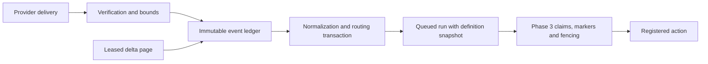

# OptiBrain Phase 4 event platform

Candidate API version: **1.9.0**. SQLite schema version: **2**.

Provider subscriptions and polling jobs are disabled by default. This release
adds event intake and read-only synchronization; receiving an event does not
authorize a new provider mutation.

## Processing path

Webhooks acknowledge only after durable capture. The recovery worker routes
accepted events and executes queued runs through the existing engine. The
authenticated internal event API retains its existing synchronous response.
Delta reads run in a separate, observable thread so provider network waits do
not hold the execution recovery worker.

## Schema and immutable evidence

`event_schema.py` explicitly migrates V1 to V2 using `BEGIN IMMEDIATE`, individual
DDL statements, and one transaction. Fresh databases first use the established
initialization and execution-control migrations, then the same event migration.
Unknown versions and incomplete V2 definitions are refused. Startup compares
the new tables, indexes and triggers against their expected definitions.

| Table | Purpose / invariant |
|---|---|
| `automation_event_ledger` | Immutable normalized source envelope, account, provider identity, content hash, receipt time and replay lineage. |
| `automation_event_dedupe` | Unique `(source, source_account, identity)` registration. Native IDs take precedence over explicit fallback identities. |
| `automation_event_processing` | Mutable status, attempts, normalized result, errors and delivery counters. Attempts are bounded to three. |
| `automation_event_history` | Processing transitions; terminal history retains the latest 20 entries after maintenance. |
| `automation_event_routes` | Unique `(root_event_id, workflow_id)` route, including legacy runs. |
| `automation_event_replays` | Durable request-key identity, original/replay IDs, actor and reviewed reason. |
| `automation_sync_checkpoints` | Provider/account/stream/mode cursor, page token, revision, lease, backoff and notification generation. |
| `automation_usage_daily` | Daily provider/metric aggregates; no request payloads or credentials. |

Triggers reject updates and deletes to original event content, ledger evidence
and dedupe registrations. Processing state never rewrites event identity or
payload. Event dedupe remains separate from action safety and run redrive.

Migration preserves existing event/run/workflow/step/claim/failure/audit rows.
Legacy events are marked routed and existing run routes are registered; old
history is not automatically executed. New copies of legacy payloads are
redacted. A sensitive legacy payload attached to unresolved execution refuses
migration rather than changing its inputs. Existing historical bytes are not
rewritten or silently erased.

## Transactions and concurrency

- Capture commits event, dedupe registration, processing state, history and
  acceptance counters together.
- Routing commits normalization, exact workflow snapshots, queued runs, route
  guards and routing history together. No handler runs inside that transaction.
- Concurrent receivers, routers and replay callers use database constraints and
  `BEGIN IMMEDIATE`; correctness does not depend on an in-process lock.
- Provider/account scope prevents collisions between different subscriptions.
  Conflicting content for an existing provider identity fails closed.
- GitHub and signed relay bodies also register a raw SHA-256 replay barrier.
  Replacing an unsigned GitHub delivery header cannot authorize another run.
- SQLite retains WAL, foreign keys, the existing busy timeout and default
  synchronous durability. Reads and provider network requests are outside write
  transactions. Migration holds the write lock deliberately and is performed
  with the production service stopped.

The normalized envelope preserves provider/account, subject, provider timestamp,
correlation, causation and a bounded evidence allowlist. All event timestamps
must include a timezone and normalize to UTC. Child events inherit correlation
and name their parent as causation. Recovery loads the complete durable envelope,
including provider fields. Self-causes, discovered cycles and excessive lineage
are rejected.
Receipt timestamps use a database-checked fixed-width UTC representation with
six fractional digits. Time-window queries compare that text directly through
the receipt index; SQLite Julian-day conversion would lose sub-millisecond
precision. Legacy receipt copies normalize the same instant without changing
the original event row.

## Webhook security and provider support

New endpoint: `POST /v1/automation/webhooks/{endpoint_name}`.

Configuration is an explicit allowlist. Secrets are environment references,
require at least 32 bytes, and are compared in constant time. Requests have
bounded streaming bodies, a ten-second read deadline, JSON/content-type checks,
duplicate security-header checks and method constraints. Signatures are checked
against raw bytes before normalization. Duplicate JSON keys, invalid constants,
malformed records and unsupported content types are rejected. Authenticated
unsupported event types are durably quarantined.

| Provider | Implemented verification / identity | Delivery and ordering limitations | Delta support in this release |
|---|---|---|---|
| GitHub | SHA-256 HMAC; delivery UUID; repository pin when configured; raw-body replay barrier. | No documented signed timestamp. No arrival-order guarantee is assumed. Redelivery may repeat an identity; conflicting evidence stops. | None; webhook intake only. |
| Zoho CRM | Configured notification token, channel ID and `server_time` freshness window; deterministic callback-content identity scoped to account. | CRM notification callbacks are hints with module, operation and IDs, not full record snapshots. No universal immutable delivery ID or payload HMAC is claimed. Token possession authenticates the callback. Retries must preserve stable callback fields; subscriptions expire and need operator renewal. | None; no full CRM scan or automatic record hydration. |
| Google Calendar | Pinned channel token, ID, resource ID and expiry; channel/message identity; empty notification body. | Notifications are change hints, not event snapshots. Message numbers are not treated as a contiguous sequence. Channel creation/renewal remains explicit; loss is reconciled by delta reads. | Events sync token + page token; 410 stops for reviewed backfill. Explicit Calendar backfill is bounded and runs once. |
| Google Drive | Same pinned push-channel controls and channel/message identity. | Notification hints; no signed payload timestamp is invented. Explicit channel renewal. | Changes page token + new start token; no implicit historical discovery. File/time version identity is conservative and conflicts stop. |
| Gmail | No native Pub/Sub ingress adapter. | Authenticated Pub/Sub push requires OIDC audience/issuer validation and operator setup; shared-secret relay is a separate contract. | Gmail history ID + page token. 404 stops for cursor recovery; no implicit mailbox scan. |
| Cloudflare | Configured `cf-webhook-auth` secret and deterministic content/body identity. | Generic notification model only. No universal signed timestamp, ordering or immutable event ID is claimed. Identical notifications can collapse conservatively. Native callback destination constraints still apply. | None; no invented generic Cloudflare delta API. |
| Signed relay | Explicit OptiBrain HMAC over `timestamp.delivery_id.raw_body`, freshness window and durable delivery/body identity. | An OptiBrain relay contract, not a native provider capability. Relay timestamps describe delivery freshness; event timestamps describe the source occurrence. | Provider-specific adapter required. |

Provider retries are never treated as permission to retry an action. Where the
provider does not supply a signed timestamp, durable dedupe is the replay barrier;
there is no claim of cryptographic freshness. No provider ordering guarantees
are required for general routing. Workflows that need entity-order semantics
must implement explicit version checks before any mutation.

Primary references checked during implementation:

- [GitHub signature validation](https://docs.github.com/en/webhooks/using-webhooks/validating-webhook-deliveries)
  and [delivery practices](https://docs.github.com/en/webhooks/using-webhooks/best-practices-for-using-webhooks).
- [Zoho CRM notification registration and callback format](https://www.zoho.com/crm/developer/docs/api/v8/notifications/enable.html).
- [Calendar push channels](https://developers.google.com/workspace/calendar/api/guides/push)
  and [incremental synchronization](https://developers.google.com/workspace/calendar/api/guides/sync).
- [Drive changes](https://developers.google.com/workspace/drive/api/guides/manage-changes).
- [Gmail push](https://developers.google.com/workspace/gmail/api/guides/push),
  [history synchronization](https://developers.google.com/workspace/gmail/api/guides/sync),
  and [Pub/Sub push authentication](https://docs.cloud.google.com/pubsub/docs/authenticate-push-subscriptions).
- [Cloudflare notification webhooks](https://developers.cloudflare.com/notifications/get-started/configure-webhooks/).

## Incremental synchronization

Google adapters use GET-only fixed provider URLs, existing OAuth token access,
bounded response streaming, timeouts and at most 100 records per page. No new
OAuth scopes or provider subscriptions are created. Account labels must match
the identity of the configured credential; this release does not discover or
manage multiple OAuth accounts.

Each configured job uses one bounded page per worker scan. A database lease,
revision and expiry fence every page commit and failure report. The original
cursor remains fixed through pagination. Page token, durable events, acceptance
counters and sync audit commit together. The final cursor advances only with
the final accepted page. A crash re-reads the uncommitted page after lease expiry;
dedupe suppresses repeated records.

Provider 429 responses respect a usable `Retry-After`; unusable advice stops the
job. Timeouts and 5xx use persisted bounded exponential backoff. Authentication,
malformed records and invalid responses stop for review. Expired cursors become
`resync_required`, never automatic full scans. Calendar backfill is a separate
checkpoint mode and requires explicit reviewed promotion of its durably completed
cursor. Drive/Gmail initial cursors require deliberate operator provisioning.

A verified Calendar/Drive push increments a notification generation in the same
intake transaction and makes an idle job due. A push during an in-flight read
survives that page commit and schedules a follow-up. Pushes cannot bypass backoff.
Push hints use `google.calendar.notification` / `google.drive.notification`;
delta records use `google.calendar.changed` / `google.drive.changed`. A hint
therefore does not accidentally match a resource-change workflow as well as the
subsequent delta record.

## Replay, quarantine and external writes

Event replay creates a distinct durable event linked to the original, with the
same correlation and the original event as causation. Request keys are durable
and cannot be rebound. Replays do not mutate the original event. Replay of a
replay is refused.

An active run, `human_action_required`, durable `ambiguous_external`, or any
human-required failure in the source family denies replay. Existing workflow
routes remain suppressed, including successfully completed external workflows
and Phase 3 low-level runs. A newly matching replay workflow may contain only
`core.set` / `core.noop`. `event.emit` is not permitted on a new replay route,
because it can cause another workflow with external actions. All new matches
are reviewed before any run is inserted; unsafe matches quarantine atomically.

Run redrive reconstructs a separately eligible execution from durable Phase 3
evidence and preserves its definition snapshot. Event replay revisits intake
normalization/routing. Neither authorizes repeating an ambiguous provider write.

Unsupported schema, sensitive payloads, deterministic processor failures and
unsafe replay routes quarantine before handlers run. Poison processing stops
after three recorded failures. Correcting a processor and initiating an eligible
authenticated replay releases a new event; the original quarantine evidence
remains. Immutable payloads cannot be edited through the API. A payload that
was redacted cannot be silently replaced with a secret or used as a placeholder
input to a provider write.

## Authenticated inspection and accounting

All detailed routes use the existing fail-closed inspection key boundary.
Missing/blank server key returns 503; missing/wrong caller key returns 401.
Public `/health` retains its small shape and reports the application version.

| Route | Purpose / bound |
|---|---|
| `GET /v1/automation/events` | Status, identity-range or UTC time-window inspection; 1–100 results. |
| `GET /v1/automation/events/{event_id}` | Envelope, normalized result, processing history and routes; lists bounded to 100. |
| `POST /v1/automation/events/{event_id}/replay` | Request key and review reason required; initiation, denial and outcome audited. |
| `POST /v1/automation/events/replay-batch` | Explicit IDs, bounded identity range or bounded time window; at most 100 source events. Per-event outcomes; not an atomic bulk operation. |
| `GET /v1/automation/event-health` | Backlog/age, quarantine, checkpoint failures/age, recent counters and delta-worker liveness. |
| `GET /v1/automation/usage` | Aggregated provider/metric values for a 1–365 day window. |
| `GET /v1/automation/sync/checkpoints` | Bounded checkpoint state without OAuth tokens or cursor values. |
| `POST /v1/automation/sync/promote-backfill` | Reviewed completed Calendar backfill revision; no arbitrary cursor skipping. |

The existing independent watchdog persists immediate alert-state transitions for
event backlog/stalls, quarantine, stopped/stale sync and delta-worker failure.
Existing claim, heartbeat, worker-stall and bounded health-sample controls remain.

Daily counters cover intake, duplicates, routing, quarantine, replay, workflows,
delta calls/failures/retries/rate limits/items/duration, and known provider/AI
action dispatch. Reported AI tokens are counted only when recognized in returned
provider usage. No speculative pricing is recorded. Action dispatch counts are
estimates of workflow calls, not exact wire-call billing; internal gateway calls,
OAuth refresh and older direct API routes are not fully instrumented.

Usage dimensions allow at most 64 named providers plus `other`; metrics are an
explicit allowlist. Usage and transient sync diagnostics age out after 365 days
in bounded maintenance batches. Terminal processing history is capped. Immutable
events, payload evidence, route guards, replay audit and dedupe tombstones remain
until an explicit archival/retention policy exists. Their storage grows with
logical events, so capacity remains an operational responsibility.

## Payload and mutation safety

New payloads redact credential-bearing keys/recognized secret values, bound
nesting/node count, and preserve only allowlisted diagnostic evidence. Raw
Authorization/Cookie headers and signing tokens are not stored or logged.
Rejected verification attempts retain aggregate counters rather than raw bodies.
This is a bounded filter, not a guarantee that arbitrary provider data contains
no sensitive business information; configure narrow event types and credentials.

Phase 3 action markers, claims, attempts, leases, conservative retry decisions,
atomic final completion and controlled redrive remain authoritative. Zoho
mutation transport ambiguity cannot fail over into a duplicate standby write.
Zoho Books and Books-synchronized CRM mutations retain their explicit approval
gate. Phase 4 introduces no new automatic provider-write operation.
