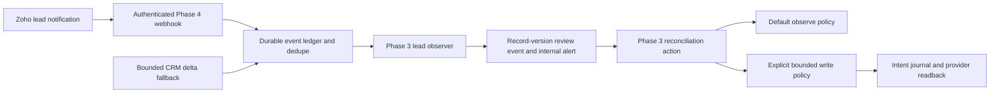

# Phase 5 business autonomy architecture

Authoritative scope: [Phase 5 campaign](OPTIBRAIN_PHASE5_AUTONOMY_CAMPAIGN.md). Starting production commit: `209aac07160e1376381faebd86fb38a18f92582a`, API `1.9.0`, automation schema `2`. Candidate API: `1.10.0`; no database migration.

## Existing business model

The read-only CRM inventory confirms the existing operational and linking modules, attribution foundations, Deal pipeline, and integrated finance modules. The governance document manages 83 existing fields, five existing layouts, three active workflows and two legacy webhooks. A live plan verified all 93 resources as `noop` after the additive changes. Resources omitted from a document are unmanaged; omission never requests deletion.

Buildings metadata is unavailable to the existing identity (`NO_PERMISSION`). Some assignment/cadence APIs reject linking modules. These entries remain explicitly unknown. There is no scope expansion or replacement model. Lead conversion topology is captured from field/layout `convert_mapping`; the attempted independent conversion-mapping endpoint was unsupported.

Existing `Lead_Status`, owner, consent, project/building fields, attribution and source identifiers serve their current purposes. Existing Deals `Service_Types` is text, so the new optional Leads `Service_Types` also uses text. No new sales taxonomy, stage, qualification status, owner mapping or synonymous attribution field is invented. Optional Leads `Next_Followup_At` supplies the genuine missing lead-level timestamp. Leaving either optional field unused is the non-destructive rollback.

## One configuration engine

The existing `DesiredStateController` and registry remain the only control plane. Registry kinds are field, layout, workflow, webhook, field update, assignment rule, scoring rule, validation rule and native notification. Provider reads fail closed; unavailable, ambiguous and paginated reads cannot become an empty inventory.

Each plan binds document name/version/hash and normalized provider state into a stable SHA-256 digest. Native subscription plans accept only the reviewed Phase 5 channel and its exact authentication references, and bind resolved callback/authentication values through a one-way configuration hash; plaintext values are never persisted. Apply validates the digest, holds a process lock, regenerates the whole plan, and checks each resource again immediately before writing. The authenticated API accepts only low-risk creates and noops; it cannot grant high-risk or destructive approval. Local validation checks versions, bounds, secrets, identity collisions and dependencies without network calls.

Write intent commits to the existing `automation_audit` table before the provider request. A crash, timeout, lost response, rejected response or failed readback leaves `started`/`manual` evidence. Even a subsequent `noop` cannot authorize another write while that evidence is unresolved. Provider request IDs are evidence only. A verified write records resource identity, actor, timestamp, document/plan/before/desired hashes, action/risk, operation/request IDs and verification result. There is no automatic journal clearing or retry permission endpoint.

| Kind | Supported reconciliation | Boundary |
| --- | --- | --- |
| Field | Exact/semantic identity, optional additive create, compared-property updates, immediate readback | Standard deletion denied; custom deletion destructive; required/unique/type/reduced-length/value removal high risk |
| Layout | Existing topology noop; append 1–5 empty sections to a custom layout with unchanged existing sections | Medium risk; layout creation, removals and complex moves manual |
| Workflow | Native configuration read/noop; inactive additive create; reviewed updates with immediate verification | Existing active updates high risk; deletion disabled |
| Workflow webhook | Redacted inventory/noop and authentication-reference validation | Writes manual until native auth/action rollback contract is proven; legacy hooks preserved |
| Field update / scoring | Read/noop, proposed drift | Mutation manual pending action/rollback proof |
| Assignment / validation | Read/noop, proposed drift | Unsupported write contracts manual |
| Native notification | HTTPS/private token references, pinned channel, bounded expiry, additive create and secret-free readback | Collision blocked; drift/renewal manual; no deletion or blind re-registration |

The hourly drift observer runs on the existing delta worker, takes the same lock, checks the two `opticable-*.json` documents and the native notification template, and persists changed resource/risk summaries. Subscription absence, collision or expiry therefore remains visible without an automatic provider write. On-demand authenticated drift and last-apply endpoints expose the same engine and journal.

## Lead lifecycle

Zoho native notifications provide a verification token over HTTPS, channel identity and a millisecond timestamp. They do not provide an independent payload signature. The existing Phase 4 adapter checks token/channel/expiry/time window, filters arbitrary payload fields, commits before acknowledgement and deduplicates retained immutable content. Existing authentication and replay controls are unchanged.

The native adapter emits source `zoho.crm`; the existing checkpoint contract requires delta events to use provider/source `zoho_crm`. The lead observer accepts both and collapses them into the same record-version review identity. This preserves both Phase 4 contracts. A single observation hydrates at most ten unique lead IDs. Larger retained batches require reviewed reconciliation rather than unbounded provider reads.

The observer reads exact IDs and creates a child event keyed by lead ID plus normalized `Modified_Time`. The child event and internal follow-up alert commit together. Repeated native events, overlapping delta pages, restart or replay cannot duplicate the child or alert. Routing context includes existing service/geography/source values; it does not reassign ownership. Stale active leads (at least one day old) receive durable internal human-action evidence. The journal stores a proposed normalization hash and next-action category rather than customer email/phone data.

The deployed initial policy is **observe**. Useful internal lead review and stale/follow-up alerts work without changing records. The implemented `phase5-lead-v1` write policy is deliberately opt-in and is tested with fake providers: one conditional normalization update, at most one internal follow-up task per lead, verification and persistent ambiguity protection across events/restarts. It changes only normalization fields, uses `If-Unmodified-Since`, disables workflows/cadences for the update, and requires explicit non-converted state. A stale reviewed version performs no write. Task subject/lead linkage resolve deterministically; collisions stop. Last-touch and first-touch attribution, consent and all site/account/contact relationships stay with their existing owner. Future last-touch updates require a proven new touch event, not reinterpretation of a generic CRM update.

Qualified Lead-to-Deal mutation remains a proposed/manual extension: there is no proven universal existing Deal identity for an unconverted Lead. This release does not create Deals, convert/merge records, maintain Books references or guess a relationship. CRM configuration itself continues to govern the existing conversion mappings. No customer communication or Books mutation action is introduced.

The delta fallback starts at an explicit deployment cursor. It reads up to 100 modified Leads with a 120-second overlap and commits events/checkpoint through Phase 4 leases. An overflowing window becomes `resync_required` without advancing the cursor. Auth failure, rate limit and provider outage retain their existing bounded recovery categories. Zoho does not guarantee an indexing lag below 120 seconds; recovery of larger gaps requires reviewed bounded reconciliation. No historical full scan starts automatically.

## Existing workflow ownership

| Existing rule | Captured trigger/actions/dependencies | Decision and cutover |
| --- | --- | --- |
| Wifi Installation (`5062683000006639142`) | Services signed-date field update; empty Workflow API Job ID, nonempty signed date and Wifi Installation criteria; function action `5062683000006639140`, function `5062683000006639136` | Keep Zoho ownership. Function side effects have no isolated equivalence proof; no parallel writer or cutover |
| General Terms Signed - Process Services (`5062683000006841055`) | Accounts General Terms Signed field update/nonempty criteria; function action `5062683000006841053`, wrapper function `5062683000006841049` | Keep Zoho ownership; no replacement, cutover or rollback mutation |
| Notify on Leads (`5062683000007022006`) | Leads create; email notification `5062683000007022002`, template `5062683000001496024`, internal CRM user recipient | Hybrid: preserve existing internal notification; add independent read-only OptiBrain lead review |

Complete normalized rule configurations and action IDs are in the inventory. Supplemental metadata captures the existing email action and Source/Industry global values. Function discovery persists safe metadata, not executable source or credentials. Active status and configuration noops prove preservation; they do not claim the operational functions were executed during this read-only campaign.

Legacy Flow webhooks `5062683000000410523` and `5062683000000554026` remain unassociated and unchanged. Retirement requires dependency proof and separate destructive human approval. Books remains human-approval only.

## Provider contracts checked

Primary Zoho API references used: [custom fields](https://www.zoho.com/crm/developer/docs/api/v8/create-custom-field.html), [layout updates](https://www.zoho.com/crm/developer/docs/api/v8/update-custom-layout.html), [workflow configuration](https://www.zoho.com/crm/developer/docs/api/v8/config-workflow.html), [email actions](https://www.zoho.com/crm/developer/docs/api/v8/email-notifications.html), [native notification create](https://www.zoho.com/crm/developer/docs/api/v8/notifications/enable.html), [notification readback](https://www.zoho.com/crm/developer/docs/api/v8/notifications/get-details.html), [conditional record updates](https://www.zoho.com/crm/developer/docs/api/v8/update-records.html). Native expiry is at most seven days; this campaign uses six days and does not silently renew an ambiguous subscription.
