# Local website preview control plane

Status: implemented and exercised locally on the PR133 candidate; unreleased. API remains the candidate's proposed **1.29.0**. Production remains **1.28.0**, SHA `205b217546372dfd37850da7721d9bba61a0746a`. This branch does not close G004.

```mermaid
flowchart LR
  P[Canonical proposal revision] --> R[Mapped repository and exact base]
  R --> E[Bounded preparation package]
  E --> G[Local proposal branch and worktree]
  G --> B[Pinned preview build and required tests]
  B --> A[Provider read ports]
  A --> V[Exact SHA and isolated preview validation]
  V --> O[Manager owner review package]
  O --> F[Revision and evidence bound owner intent]
  F --> C[Production executor contract only]
```

Canonical Optimization Proposals remain in `optimization_records`. Preview observations refer to the canonical ID, revision and payload hash; no competing proposal database exists. Repository metadata uses existing Acquisition `SOURCE` entities/facts with source `website` and native ID `github:<owner>/<repository>`. Manager's existing website source projects those records. All tables share the existing `phase12-autonomy.db` journal path when integrated; tests create temporary journals.

## Persistence and compatibility

`WebsitePreviewStore` extends `OptimizationStore`; `ManagerStore` inherits the extension. Two additive tables contain append-only preview observations and unique webhook delivery receipts. Canonical proposal revisions remain immutable. Latest observations require the current revision/hash and exact repository mapping in canonical proposal detail. Optimistic sequence checks prevent lost observation updates. Owner feedback uses an immediate SQLite transaction to check that revision and observation sequence remain unchanged.

There is no historical proposal backfill. A website proposal without preview observations projects `NOT_COLLECTED`, “No preview prepared.” Existing Ads, Forms, Sales and other owner intent behavior remains compatible. The additive table creation is idempotent and tested; rollback disables consumers and leaves evidence retained. A fixture also proves dropping only the two new tables preserves canonical proposals. Production schema changes are not performed tonight.

## Models and gates

Repository metadata includes repository ID/provider/full name/default and production branches, observed/analyzed SHA, last fetch date, clone path, auth mode, preview provider/project, health and original source time. The configured clone is reused; `fetch_state_from_adapter` compares incremental provider observations with local state and never reclones. The read port does not run live fetches or install a cloning job.

Preview observations contain canonical ID/revision/hash, repository, base ref/SHA, proposal branch/head SHA, worktree path, PR number, preview project/version ID/URL, independent build and required test results, stale/owner states, timestamps, rollback base, evidence references and `production_impact=NONE`. Commit, file and semantic hashes support replay suppression. Identical prepared source skips commit/build work; a fresh unchanged preview skips workflow/Cloudflare/HTTP revalidation until its receipt expires.

The lifecycle supports `NOT_ELIGIBLE`, `PREPARATION_ELIGIBLE`, `BRANCH_PENDING`, `BRANCH_CREATED`, `WORKTREE_CREATED`, `PREPARING`, `BUILDING`, `BUILD_FAILED`, `TESTING`, `TEST_FAILED`, `PREVIEW_PENDING`, `PREVIEW_READY`, `OWNER_REVIEW`, `REVISION_REQUESTED`, `APPROVED`, `REJECTED`, `DEFERRED`, `STALE_BASE`, `CONFLICTED`, `SUPERSEDED`, `PROVIDER_BLOCKED` and `READY_FOR_PRODUCTION_EXECUTOR`. Intermediate local states are durable observations. Reconciliation stops terminal/deferred/revision-requested proposals. `APPROVED` records owner intent and never means deployed.

Readiness is recomputed, rather than inferred from a persisted READY string. It needs exact proposal/revision/repository/base/branch/head linkage in deployment and HTTP manifest, successful SHA-bound build and every required test, a current default branch, fresh verification, successful provider reads, explicit preview environment/isolation, and HTTP validation. The receipt expires after one hour. A materially changed tuple or expired receipt makes owner approval stale.

## Git and worktrees

`LocalGitAdapter` verifies clone root, remote and common Git directory before operations. Branches are `optimization/<canonical-id>-<normalized-slug>`, capped at 120 characters. Full 64-character historical proposal IDs are preserved. Worktrees use a deterministic repository/ID path under a private configured proposal root, with a separate private identity record and a cap of three active worktrees. Git mutations are serialized using a common-repository lock. There is no removal function.

Text replacements require an exact unique before-text and an explicit file allowlist. Git hooks, external filters, signing and external diffs cannot turn preparation into command injection. Build definitions are an operator-reviewed catalog of Python script path/hash/class/time bounds; data can select a class but cannot supply argv or shell commands. The build environment contains preview/noindex/tracking-off values and excludes provider credentials. Reviewed scripts remain responsible for their own child processes and resource behavior; arbitrary repository code is not automatically trusted or sandboxed by this runner.

Stale comparison uses exact base equality, ancestry for superseded proposals, and isolated `git merge-tree` conflict detection. It never merges into the working source tree. A remote SHA that is not locally available remains `NEEDS_REBASE` until incremental fetch/import makes comparison possible.

## Manager and operations

Manager displays repository/base/proposal SHA, branch, build/test/preview/provider-blocked/stale/owner states, verified URL and WHY/EVIDENCE/CURRENT/PROPOSED/PREVIEW/TESTS/RISK/APPROVAL STATUS. Owner priorities reuse `optibrain.business_priority`: REVIEW PREVIEW, PROVIDER ACCESS REQUIRED, REVISION REQUESTED and STALE PREVIEW. No new priority queue, scheduler, live webhook endpoint or background development worker is installed.

[Provider ports](provider-contracts.md), [security](security.md), [operator runbook](operator-runbook.md) and [owner configuration](owner-actions.md) define controlled execution graduation. Live adapters, pinned website command policy, receiver deployment and hosted validation remain graduation work after remediation closure; production execution remains a separate authority boundary.
